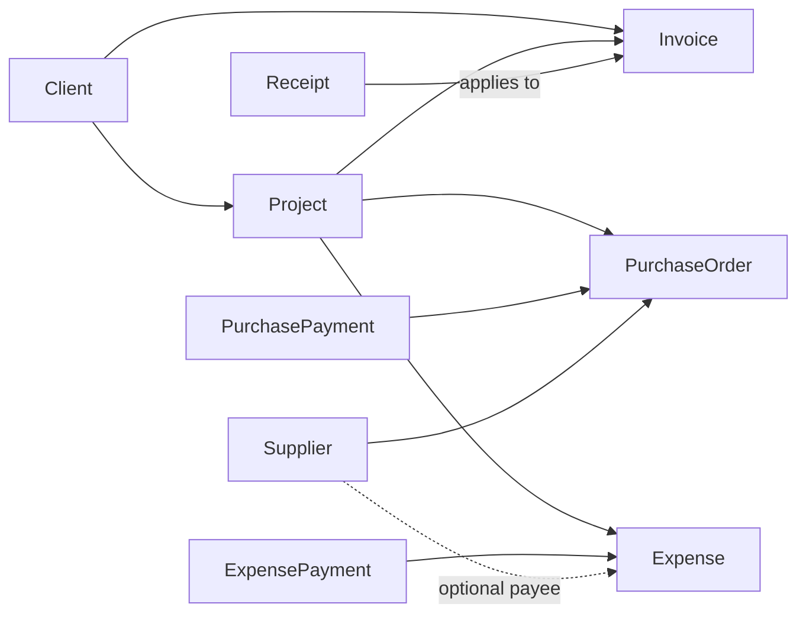

# Finance, Expenses, and Project Profitability Plan

Status: Application implementation complete. Database audit and rollout pending.

## 1. Goal

Add a small finance layer that answers four practical questions without turning the app
into a full accounting system:

1. How much do clients still owe us?
2. How much do we still owe suppliers or other payees?
3. How much money did we actually receive and pay?
4. Did a client project make money after purchase and operating costs?

The module must connect existing invoices, receipts, purchase orders, and purchase
payments instead of copying their values into separate totals.

## 2. Current-state findings

### Already available

- Sales documents already link to a client through `documents.client_id`.
- Receipts already represent money received and may be created from an invoice or pro
  forma through `documents.converted_from`.
- Purchase orders already link to suppliers.
- `purchase_payments` already records actual amounts paid against a purchase order, so
  the PO payable balance can already be calculated.
- Sales report snapshots and PDF/Excel export patterns can be reused for finance reports.

### Missing or unsafe for financial reporting

- Invoice `paid` status is manually selected; it is not proven by linked receipts.
- A receipt does not have a dedicated invoice-allocation field. `converted_from` is
  document lineage and may point to a quote, pro forma, or invoice.
- The dashboard's current Outstanding value sums every invoice not marked paid. Draft or
  lost invoices can therefore be treated as receivable.
- Client totals currently include several document types. Summing quotes, invoices,
  pro formas, and receipts together can double-count business value.
- Purchase orders have a free-text `reference` field but no real project relationship.
- There is no expense record for salary, fuel, rent, utilities, or other non-PO costs.
- There is no common project entity joining client revenue to purchase and expense costs.

## 3. Recommended domain model

### Canonical terms

- **Project**: a client-owned job used to group sales, purchases, expenses, and payments.
- **Receivable**: the remaining amount a client owes on an issued tax invoice.
- **Payable**: the remaining amount owed on an active purchase order or posted expense.
- **Receipt**: evidence of money actually received. A draft receipt is not cash received.
- **Purchase payment**: money actually paid against a purchase order.
- **Expense**: a non-PO cost such as salary, petrol, rent, utilities, or a client-related
  incidental cost.
- **Expense payment**: money actually paid against an expense.
- **Net cash**: money received minus money paid in the selected period.
- **Project margin**: invoiced sales excluding VAT minus project costs excluding
  recoverable VAT. This is not the same as cash in the bank.

### Relationship map



One project belongs to one client. Documents, purchase orders, and expenses may remain
unassigned when the transaction is general business overhead rather than project work.

## 4. Important design decisions

### 4.1 Do not create separate payable or receivable transaction tables

Receivables and payables are calculated views of existing source records:

- Receivable comes from invoice total minus issued receipts applied to that invoice.
- PO payable comes from PO total minus `purchase_payments`.
- Expense payable comes from expense total minus `expense_payments`.

This avoids maintaining the same balance in two places.

### 4.2 Do not record a PO again as an expense

A purchase order already represents a supplier cost and has its own payment log. Adding
the same PO value as an expense would double-count both project cost and cash paid.

Recommended rule:

- Material or supplier cost with a PO: link the PO to the project/client and use the PO
  plus its payments.
- Salary, petrol, rent, utility, or other cost without a PO: record an expense.
- If supplier bills must later be matched to POs, add a dedicated vendor-bill workflow;
  do not simulate it with a duplicate expense.

### 4.3 Keep invoiced margin and cash movement separate

The overview must show both because they answer different questions:

- **Invoiced net sales**: invoice subtotal minus discount, excluding VAT.
- **Money received**: issued receipt amounts in the period.
- **Committed project cost**: active PO net cost plus posted expense net cost.
- **Money paid**: purchase payments plus expense payments in the period.
- **Project margin**: invoiced net sales minus committed project cost.
- **Net cash**: money received minus money paid.

VAT-inclusive totals are used for receivable, payable, and cash. VAT-exclusive values are
used for margin so VAT is not presented as earnings. An expense can mark VAT as
recoverable; non-recoverable VAT remains part of its cost.

### 4.4 Saved reports are snapshots; finance screens are live

Receivables, payables, and project balances should be live by default. PDF and Excel
exports use the same calculation module. Month-end saved snapshots can be added later if
the client needs historical close reports; every filter change should not create a saved
record.

## 5. Proposed data changes

### 5.1 `projects`

| Column | Purpose |
| --- | --- |
| `id` | UUID primary key |
| `client_id` | Required client owner |
| `code` | Optional short job code |
| `name` | Required project name |
| `status` | `active`, `completed`, or `cancelled` |
| `start_date`, `end_date` | Optional project dates |
| `notes` | Internal notes |
| audit columns | Creator and timestamps |

Add nullable `project_id` foreign keys to:

- `documents`
- `purchase_orders`
- `expenses`

When a sales document has a project, its client must match the project's client. A PO
inherits the client for reporting through its project.

### 5.2 Receipt allocation

Add nullable `applies_to_invoice_id` to `documents`, used only when `type = 'receipt'`.
One invoice may have many receipts; one receipt applies to at most one invoice in the
first version. A payment covering several invoices should be entered as one receipt per
invoice with the same bank reference.

Add `void` to receipt status. Only `issued` receipts count as money received or reduce a
receivable.

This field is separate from `converted_from`, which remains document history.

### 5.3 Due dates

Add nullable `due_date` to invoices and purchase orders. Expenses include their own due
date. Reports must show "Due date not set" rather than inventing a date from free-text
payment terms.

### 5.4 `expense_categories`

Configurable category list with `id`, `name`, `active`, and `sort_order`. Seed values:

- Salary
- Petrol / fuel
- Transport
- Rent
- Utilities
- Tools and equipment
- Materials without PO
- Subcontractor
- Client-related expense
- Other

### 5.5 `expenses`

| Column | Purpose |
| --- | --- |
| `id` | UUID primary key |
| `expense_date` | Date cost was incurred |
| `due_date` | Optional payment due date |
| `category_id` | Required expense category |
| `description` | Required explanation |
| `payee_name` | Employee, shop, landlord, or other payee snapshot |
| `supplier_id` | Optional known supplier |
| `client_id` | Optional direct client attribution |
| `project_id` | Optional project attribution |
| `status` | `draft`, `posted`, or `void` |
| `subtotal` | Cost before VAT |
| `vat_amount` | VAT amount, zero for salary and similar costs |
| `vat_recoverable` | Whether VAT is excluded from margin cost |
| `grand_total` | Cash/payable amount |
| `reference`, `notes` | Supporting details |
| audit columns | Creator/updater and timestamps |

Payment state is derived, not stored:

- Unpaid: paid amount is zero.
- Partial: paid amount is above zero but below total.
- Paid: paid amount is equal to or above total.

### 5.6 `expense_payments`

Mirror the existing PO payment log: `expense_id`, payment date, method, reference,
amount, notes, and audit columns.

## 6. Calculation rules

### Accounts receivable

For each non-draft, non-lost invoice:

```text
received = sum(issued receipts where applies_to_invoice_id = invoice.id)
receivable = max(invoice.grand_total - received, 0)
```

Show unapplied or excess receipt amounts separately; never hide an overpayment by making
the invoice balance negative.

### Accounts payable

For each PO with status `ordered`, `partial`, or `received`:

```text
PO payable = max(PO grand_total - purchase payments, 0)
```

For each posted, non-void expense:

```text
expense payable = max(expense grand_total - expense payments, 0)
```

Total payable is the sum of both sources. Draft/cancelled POs and draft/void expenses are
excluded.

### Project profitability

```text
net sales = invoice subtotal - invoice discount
PO net cost = PO subtotal - PO discount
expense net cost = expense subtotal + non-recoverable VAT
project margin = net sales - PO net cost - expense net cost
margin percentage = project margin / net sales
net cash = issued project receipts - project PO payments - project expense payments
```

Cancelled, lost, draft, and void records are excluded. Unassigned records remain visible
under an **Unassigned** group so missing links never silently disappear from totals.

## 7. Modules and interfaces

Use one finance calculation module as the seam for the UI, project pages, dashboard, and
exports. Callers should not rebuild joins or formulas.

Recommended server interface:

```text
loadFinanceSummary(filters) -> sales, receipts, costs, payments, margin, net cash
loadReceivables(filters)    -> invoice rows with received and balance
loadPayables(filters)       -> unified PO/expense rows with paid and balance
loadProjectFinance(id)      -> one project's sales, costs, payments, and margin
```

Keep pure balance and total calculations in `src/utils/finance.ts` with boundary tests.
Database querying and row normalization belong in one server-only finance data module.

## 8. User-facing modules

### Projects

- Project list: client, status, invoiced sales, cost, received, paid, margin.
- Project detail: linked quotes/pro formas/invoices/receipts, POs, expenses, and finance
  summary.
- Project selector on document, PO, receipt, and expense forms.
- Selecting a project on a sales document automatically selects and validates its client.

### Expenses

- List with date, category, payee, client/project, payment state, and total.
- Add/edit expense with category, optional project/client, VAT, due date, and notes.
- Expense detail with payment log.
- Filters by period, category, project, client, payee, and payment state.

### Receivables report

- Invoice, client, project, invoice date, due date, total, received, balance, and age.
- Filters for as-of date, client, project, payment state, and aging bucket.
- Aging buckets: current, 1-30, 31-60, 61-90, and over 90 days. Invoices without a
  due date are shown separately.
- PDF and Excel export from the same rows shown on screen.

### Payables report

- Unified source column: Purchase order or Expense.
- Supplier/payee, project, date, due date, total, paid, balance, and age.
- Filters for as-of date, source, supplier/payee, project, payment state, and aging bucket.
- PDF and Excel export.

### Finance overview

- Invoiced net sales
- Money received
- Outstanding receivables
- Committed costs
- Money paid
- Outstanding payables
- Project margin
- Net cash

All cards use the same selected period and provide links to their supporting rows.

## 9. Access recommendation

- Keep Projects available to `super` and `staff`.
- Keep PO payables under the existing procurement permission.
- Keep receipt allocation and invoice balance available to users who can manage invoices.
- Restrict the combined Finance overview and Expenses module to `super` initially because
  salary expenses are sensitive.
- Add a dedicated finance role only when another real user needs finance access; do not
  introduce category-level salary permissions in the first version.

## 10. Existing-data migration

Run an audit before enabling financial totals:

1. List receipts whose `converted_from` is an invoice. These can be proposed for automatic
   `applies_to_invoice_id` backfill.
2. List receipts created from pro formas or manually. These need manual invoice/project
   selection where applicable.
3. List invoices marked paid without an issued receipt. Treat them as legacy paid for
   receivable display, but do not invent a cash-received date or include them in period
   cash totals.
4. Flag invoice overpayments, receipt amounts of zero, and deleted/missing source links.
5. List PO references that appear to be project names for manual project assignment.
6. Keep all existing client, invoice, receipt, PO, and payment records unchanged until the
   audit is reviewed.

## 11. Implementation phases

### Phase 0 - Confirm rules and audit current records

- Approve the definitions of receipt, receivable, payable, net cash, and project margin.
- Run the existing-data audit above.
- Decide which legacy paid invoices have supporting receipts.

### Phase 1 - Foundation migration

- Add projects, project foreign keys, receipt invoice allocation, due dates, expense
  categories, expenses, and expense payments.
- Add indexes, constraints, and RLS policies.
- Add pure finance calculations and tests before building pages.

### Phase 2 - Projects and linkage

- Build project list/detail/edit.
- Add project selectors to documents and POs.
- Show an Unassigned warning/filter for existing records.

### Phase 3 - Receipts and receivables

- Add invoice selection to receipt creation/editing.
- Display received amount and balance on invoice detail.
- Build receivables list and aging filters.
- Stop using manually selected invoice Paid status as the financial source of truth.

### Phase 4 - Expenses and payables

- Build expense CRUD, category management, and expense payment log.
- Add project/client linkage.
- Build unified payables report from POs and expenses.

### Phase 5 - Profitability and finance overview

- Add client/project finance summary.
- Add period filters and Unassigned reconciliation.
- Replace the current dashboard Outstanding calculation with the finance module result.

### Phase 6 - Reports and exports

- Add formatted PDF and Excel exports for receivables, payables, expenses, and project
  profitability.
- Reuse the current Sales Invoice Report visual language.
- Add optional month-end saved snapshots only if the client confirms they are required.

### Phase 7 - Verification and rollout

- Reconcile report totals to source records.
- Test partial payments, overpayments, missing due dates, voided receipts, cancelled POs,
  unpaid salaries, and unassigned records.
- Verify role restrictions and salary privacy.
- Back up the database, run migration, perform the reviewed backfill, and compare pre/post
  totals before release.

## 12. Acceptance scenarios

1. A AED 10,500 invoice with issued receipts of AED 4,000 and AED 6,500 shows zero
   receivable and AED 10,500 received.
2. A draft receipt does not reduce receivable or increase cash received.
3. A AED 5,000 PO with AED 2,000 paid shows AED 3,000 payable and is counted once as a
   project cost.
4. A petrol expense of AED 525, including AED 25 recoverable VAT, contributes AED 500 to
   margin cost and AED 525 to cash paid when settled.
5. An unpaid AED 8,000 salary contributes AED 8,000 expense payable and cost, but zero cash
   paid until a payment is recorded.
6. A project with AED 20,000 net invoiced sales, AED 8,000 PO cost, and AED 2,000 expenses
   shows AED 10,000 project margin. If it received AED 10,000 and paid AED 5,000, net cash
   is AED 5,000.
7. Draft, lost, cancelled, and void records do not enter finance totals.
8. Unassigned transactions are visible and reconcile to overall totals.

## 13. Explicitly deferred

- Full double-entry bookkeeping or general ledger
- Bank feeds and bank reconciliation
- Payroll calculation, payslips, or employee HR records
- Inventory and stock valuation
- Multi-currency revaluation
- Automatic recurring expenses
- Vendor bill matching and three-way PO/receipt/invoice matching
- Budgeting and forecasting

These should be added only when the client has a real workflow that needs them.
